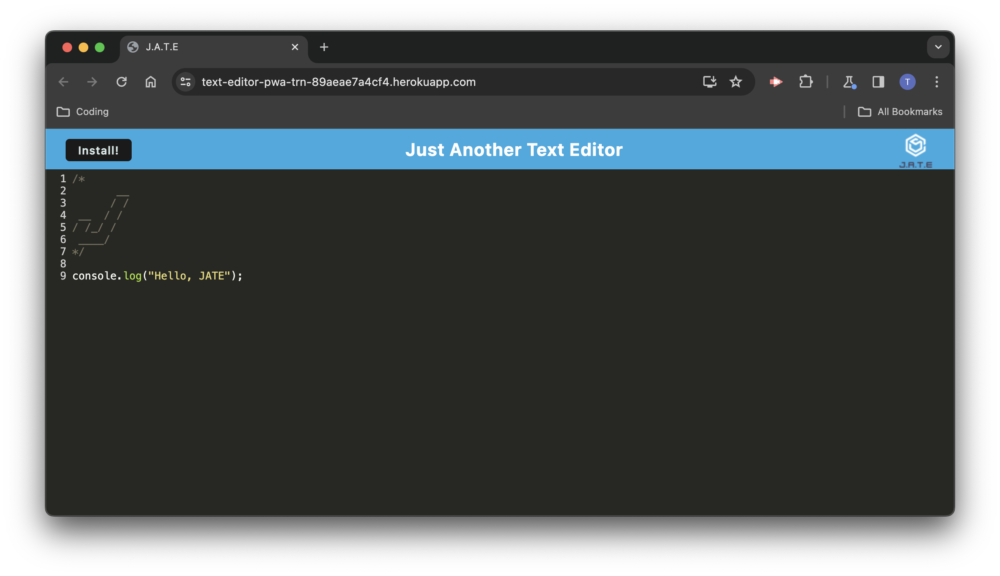

# Text Editor PWA

(`text-editor-PWA` - Module 19 Challenge)

A text editor built as a single-page app that is installable and available offline.

## Description

- This text editor is a single-page app that allows you to write code with syntax-highlighting. It can also be downloaded and used offline, with persistent data. It has been designed to meet PWA criteria.
- It is written primarily in JS using the [`Node.js`](https://nodejs.org/en) runtime environment, employs a collection of [`Workbox libraries`](https://github.com/googlechrome/workbox) for PWA functionality, and is bundled with [`webpack`](https://www.npmjs.com/package/webpack).
- On top of asset caching, the editor uses [`IndexedDB`](https://developer.mozilla.org/en-US/docs/Web/API/IndexedDB_API) for client-side storage to ensure the persistence of inputted text data across sessions, regardless of the user's connection.

## Table of Contents

- [Description](#description)
- [Installation](#installation)
- [Usage](#usage)
- [Tests](#tests)
- [License](#license)
- [Questions](#questions)

## Installation

No installation is necessary; please visit the deployed site [**here**](https://text-editor-pwa-trn-89aeae7a4cf4.herokuapp.com/).

## Usage

1. Upon visiting the site, you will be met with the text editor as shown here:  
   
2. You can clear any of the existing lines or characters and add your text. The editor has basic syntax highlighting:  
   
3. Using the 'Install' button in the header, or the browser's built-in button, the app can be installed for offline use. (Please note, the editor will still function offline whether installed or not.)
4. Data will persist between sessions, and windows.

The following GIF provides a brief demonstration:  

## Tests

No tests have been written for this application.

## License / Credits

A large portion of this code was supplied and part of course-work - please see the [initial commit](https://github.com/trnigg/text-editor-PWA/pull/1/commits/fa0447c02f339e4ce9de5d8b73b3b8aa3ef726c2).

## Questions

For any questions, [issues](https://github.com/trnigg/text-editor-PWA/issues) or feedback, please reach out to me on GitHub at [trnigg](https://github.com/trnigg/).
